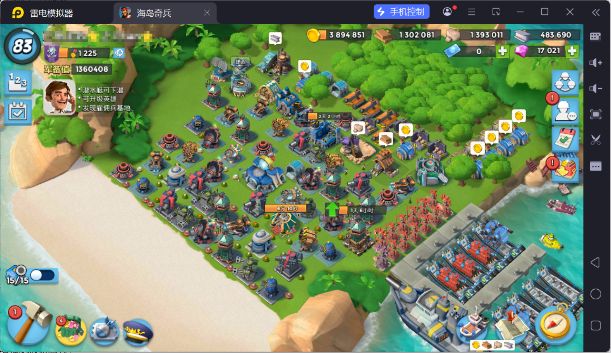

# BoomBeachSonarAuto

基于 **ADB + OpenCV** 的海岛奇兵声呐活动界面自动化与菱形网格识别工具。项目会通过 ADB 获取模拟器截图，使用模板匹配进入活动页面，读取人工校准点位或自动识别菱形网格中心点，优先使用搜索算法探索潜艇位置，缺少潜艇配置时回退逐格扫描，最后生成命中可视化图片。

> 说明：本项目仅用于图像识别、自动化流程和个人学习研究。使用前请确认不会违反目标应用的用户协议或平台规则。请自觉在24小时后删除。
建议有python或自动化工具开发基础的人员使用，使用本软件的风险完全由用户自行承担，作者不对任何直接或间接损失承担责任。

## 功能特性

- 通过 ADB 连接安卓模拟器或设备。
- 使用模板图片识别活动入口、登录按钮、退出按钮、母舰图标等 UI 元素。
- 支持按关卡配置不同菱形网格边长。
- 支持 1 至 36 号海域的自动化搜索算法探索，后续海域可手动配置扩展。
- 舍弃原有全海域迭代，使用潜艇搜索策略减少实际探测次数。
- 优先使用人工校准后的固定点位，点位缺失或数量不匹配时回退到自动识别。
- 通过 root ADB shell 使用 iptables 按游戏 UID 控制 DROP 弱网和 REJECT 断网。
- 主流程通过日志输出状态、命中矩阵和结果图片路径。
- 提供 PyQt6 调试工具，用于实时坐标查看、鼠标手势标点、ROI 选区、完整截图保存、模板保存、人工校准点位、弱网和断网开关诊断。

## Update

2026.6 (new)
- 进入活动流程改为最多 5 次有限重试，失败时重启游戏、等待登录后再重新进入。
- 主流程输出统一走日志，命中矩阵和结果图片路径会记录到 `_debug/logs/bbma.log`。
- 补充主流程入口恢复逻辑的单元测试。
---
- 简化海域配置生成逻辑
---
- 更新了 _debug/debug_gui.py 添加了完整截图、跳转标记、鼠标左右键选中的快捷操作
- 调整断网延迟，降低重试时仍断网的几率
---
- 舍弃原有全海域逐格迭代，改用潜艇搜索策略，大幅加快探索速度。
- 当前已完全支持 1 至 ~~11~~ 36 号海域的自动化搜索算法探索。（其实就是复用14号海域，后续海域重复无变化）
- 添加对自动化搜索算法的单元测试。
---
- 完全修复弱网不稳定问题使用 REJECT 断网消除本地缓存。
- 优化程序流程，大幅加快运行速度。
- 网络控制已区分为两类规则：DROP 弱网和 REJECT 断网。

## 项目结构

```text
.
├── main.py                    # 主入口，执行自动化流程
├── config.py                  # 路径、ADB 设备、包名、日志、网格和模板匹配配置
├── take_screenshot.py         # 保存海域截图到 save_points/imgs/，用于新增海域点位校准
├── requirements.txt           # Python 依赖
├── template/                  # 模板匹配所需图片
├── save_points/
│   ├── points.py              # 点位 JSON 读写、生成和读取工具
│   └── points.json            # 人工/自动生成的固定点位数据
├── utils/
│   ├── adb_control.py         # ADB 封装、手势、应用启动和弱网/断网控制
│   ├── image_match.py         # 模板匹配
│   ├── diamond_centers.py     # 菱形网格检测与中心点计算
│   ├── diamond_hit.py         # 点击前后截图对比与命中判断
│   ├── submarine_strategy.py  # 潜艇搜索策略、确认和安全区推断
│   └── logger.py              # 日志配置
├── tests/                     # 策略和主流程单元测试
├── _debug/
│   ├── debug_gui.py           # 实时坐标/手势标点/ROI 选区/模板保存 GUI
│   ├── point_editor.py        # 人工点位校准 GUI
│   ├── weak_network_gui.py    # 弱网与断网开关、诊断 GUI
│   ├── screenshots/           # 调试截图输出
│   └── logs/                  # 日志文件
└── outputs/                   # 命中可视化结果输出
```

## 环境要求

- Python 3.10 或更高版本。
- 已安装并可在命令行使用的 `adb`工具。
- 一台已开启 ADB 调试的安卓设备或模拟器。
- 设备需要支持 `adb root`，否则脚本无法使用 iptables 自动控制弱网或断网。
- 海岛奇兵国服（国际服未测试），如需使用请自行修改 `GAME_PACKAGE_NAME` 和流程坐标。
- 建议使用雷电模拟器，并将分辨率设置为 `1280x720`。
- 当前模板图片与设备分辨率、游戏界面语言、UI 状态尽量一致。

## 安装

进入项目目录后运行：

```powershell
python -m venv .venv
.\.venv\Scripts\activate

pip install -r requirements.txt
```

如果在 macOS/Linux 上运行，虚拟环境激活命令通常为：

```bash
source .venv/bin/activate
```

## 配置

打开 `config.py`，按你的设备环境调整配置。

| 配置项 | 默认值 | 说明 |
| --- | --- | --- |
| `ADB_SERIAL` | `127.0.0.1:5555` | ADB 设备序列号或模拟器连接地址 |
| `GAME_PACKAGE_NAME` | `com.tencent.tmgp.supercell.boombeach` | 默认控制的游戏包名 |
| `TEMPLATE_DIR` | `template/` | 模板图片目录 |
| `SCREENSHOT_DIR` | `_debug/screenshots/` | 截图和运行调试图保存目录 |
| `LOG_FILE` | `_debug/logs/bbma.log` | 主流程日志文件路径 |
| `OUTPUT_DIR` | `outputs/` | 命中可视化图片输出目录 |
| `LEVEL_GRID_SIZES` | `1: 3` 到 `36: 10` | 各海域对应的菱形网格边长 |
| `SUBMARINES` | `1` 到 `36` | 各海域潜艇长度列表；后续海域需手动填写 |
| `USE_SAVED_POINTS` | `True` | 是否优先使用 `save_points/points.json` 中的人工点位 |
| `SAVED_POINTS_FILE` | `save_points/points.json` | 固定点位 JSON 文件 |
| `DEFAULT_MATCH_THRESHOLD` | `0.85` | 默认模板匹配阈值 |
| `DEFAULT_TEMPLATE_SHAPE_WEIGHT` | `0.9` | 模板形状相似度权重 |
| `DEFAULT_TEMPLATE_SHAPE_POWER` | `3.0` | 模板形状相似度放大系数 |
| `LOG_LEVEL` | `INFO` | 日志级别 |

连接设备前可以先检查 ADB：

```powershell
adb devices
adb connect 127.0.0.1:5555
```

如果你的设备不是 `127.0.0.1:5555`，请把 `config.py` 中的 `ADB_SERIAL` 改成 `adb devices` 显示的设备 ID。

弱网和断网控制依赖 root shell，运行 main.py 前建议确认：

```powershell

adb -s 127.0.0.1:5555 shell id -u
```

第二条命令输出 `0` 才表示当前 ADB shell 已具备 root 权限。

## 使用方法

1. 启动安卓模拟器或连接安卓设备，分辨率为 `1280x720`。
2. 确认设备已登录到游戏主界面，并且声呐活动入口可见。
3. 确认 `template/` 目录下的模板图片能匹配当前界面。
4. 如需运行指定关卡，在 `main.py` 底部修改 `level`。

```python
if __name__ == "__main__":
    register_exit_cleanup()
    level = 1
    try:
        adb.ensure_root_shell()
        cleanup_reject_network("主流程启动")
        main(level)
    finally:
        cleanup_weak_network("主流程结束")
        cleanup_reject_network("主流程结束")
```

运行主程序：

```powershell
python main.py
```

运行结束后，命中可视化图片会保存到：

```text
outputs/hit_map_level_<level>.png
```

日志文件会保存到：

```text
_debug/logs/bbma.log
```

运行过程中的点击前后截图会保存到：

```text
_debug/screenshots/run_debug/
```

## 支持自定义海域

目前已完全支持 1 至 36 号海域的自动化搜索算法探索。若想手动支持后续海域，需要补充潜艇长度和人工点位：

1. 修改 `config.py` 中的 `SUBMARINES`，填写目标海域的潜艇长度列表。潜艇长度可在声呐界面左侧查看。
2. 模拟器进入目标声呐界面，进入即可，不要手动拖放或缩放海域视角。
3. 修改 `take_screenshot.py` 中的保存路径，将截图保存为 `save_points/imgs/<海域编号>.png`，例如 `save_points/imgs/12.png`，然后运行：

```powershell
python take_screenshot.py
```

4. 使用点位校准工具打开刚才保存的截图，调整定位并保存：

```powershell
python _debug/point_editor.py
```

完成以上设置后即可支持自定义海域。懒得配置的话，可以等待作者后续更新。

## 人工点位

主流程默认 `USE_SAVED_POINTS = True`，会优先读取 `save_points/points.json`：

- 固定点位包含关卡截图路径、网格边长、图片尺寸、大菱形四角和每个小格中心点。

人工校准点位：

```powershell
python _debug/point_editor.py
```

点位校准GUI工具支持拖动外层大菱形四角、拖动每个小菱形中心点、重新规划海域棱形中心点，并保存到 `save_points/points.json`。

## 弱网控制

当前主流程已通过 ADB root + iptables 自动实现游戏网络控制，不再需要 QNET。脚本在进入活动前开启游戏弱网，在重启游戏和退出脚本时关闭弱网。

项目同时提供 REJECT 断网能力。REJECT 使用独立 `BBMA_REJECTNET` 链，它并不会关闭整机 Wi-Fi 或移动数据。

也可以单独启动弱网/断网调试工具：

```powershell
python _debug/weak_network_gui.py
```

弱网调试工具支持以下操作，并读取对应 iptables/ip6tables 诊断信息：

- `开启弱网(DROP)`
- `关闭弱网(DROP)`
- `开启断网(REJECT)`
- `关闭断网(REJECT)`

专用日志保存到：

```text
_debug/logs/weak_network_gui.log
```

## 图片说明

启动脚本前需手动登录进主界面（如图）：
<p align="left"></p>

最终输出示例，红色方框即为潜艇：
<p align="left"></p>

## 调试工具

截图调试和模板裁剪 GUI：

```powershell
python _debug/debug_gui.py
```

常见用途：

- 自动点击位置不准时，查看鼠标实时坐标，左键单击标点，或输入 x/y 坐标跳转标记。
- 需要完整模拟器画面时，直接保存当前完整截图，避免拖拽裁剪漏掉边缘像素。
- 需要取消时，右键点标记可删除标记，右键空白或 ROI 区域可清除当前 ROI。
- 新设备或新分辨率适配时，可根据自己的模拟器左键拖拽（亦可查看查看 ROI 的 `x, y, w, h`）选中 ROI 后保存到 `template/` 下，更新关键模板。

人工点位校准 GUI：

```powershell
python _debug/point_editor.py
```

弱网与断网开关、诊断 GUI：

```powershell
python _debug/weak_network_gui.py
```

## 模板图片说明

当前主流程会使用以下模板：

| 文件 | 用途 |
| --- | --- |
| `template/activity_button.png` | 活动入口按钮 |
| `template/login.png` | 登录按钮 |
| `template/quit_activity.png` | 活动详情页退出按钮 |
| `template/ship.png` | 母舰图标 |
| `template/retry.png` | 断网重试图标 |

`template/qnet_button_off.png`，为旧版 QNET 流程参考；当前主流程不再依赖该模板。

如果界面发生变化、分辨率不同或模板匹配失败，需要重新裁剪对应模板。

## 输出与调试文件

- `outputs/`：主流程结果图。
- `_debug/screenshots/`：运行过程中的截图和中间图。
- `_debug/screenshots/run_debug/`：点击前后截图、退出按钮匹配调试图。
- `_debug/logs/bbma.log`：主流程日志文件。
- `_debug/logs/weak_network_gui.log`：弱网调试 GUI 日志文件。

## 常见问题

### 找不到 ADB 设备

先运行：

```powershell
adb devices
```

如果没有设备，检查模拟器是否开启 ADB，或重新执行：

```powershell
adb connect <设备地址>
```

然后同步修改 `config.py` 中的 `ADB_SERIAL`。

### 无法开启弱网或断网

可能原因：

- 当前设备不支持 `adb root`。
- `adb shell id -u` 输出不是 `0`。
- 设备缺少 `iptables`。
- 游戏包名配置不正确，导致无法读取 UID。

主流程启动时会执行 `adb.ensure_root_shell()`。如果无法获得 root shell，脚本会中止，避免弱网或断网控制弹出授权窗口或残留异常状态。

如果 REJECT 断网效果不明显，优先使用 `_debug/weak_network_gui.py` 查看 REJECT 诊断，确认 `BBMA_REJECTNET` 跳转规则和链内规则是否存在并被命中。

### 模板匹配失败

可能原因：

- 模板图片与当前分辨率不一致（请设置为1280*720）。
- 模板区域裁剪过大或包含动态背景。

可以使用 `_debug/debug_gui.py` 左键拖拽 ROI 并保存为模板，再适当调整 `DEFAULT_MATCH_THRESHOLD`。

### 菱形网格识别失败

可能原因：

- 截图中网格区域被遮挡。
- 当前画面不是活动详情页。
- 使用了特殊的海岛基地皮肤（建议换为原版）。
- 当前关卡没有人工点位，且自动识别没有找到稳定外框。

建议优先使用 `_debug/point_editor.py` 为该关卡保存人工点位。也可以查看 `_debug/screenshots/` 下的中间图片，确认程序检测到的外框是否正确。

## License

本项目源码公开，仅允许非商业用途。

未经作者书面授权，禁止将本项目用于商业产品、付费服务、商业自动化、商业代练、商业测试、商业运营、二次售卖或任何直接/间接盈利场景。

详见 [LICENSE](./LICENSE)。
